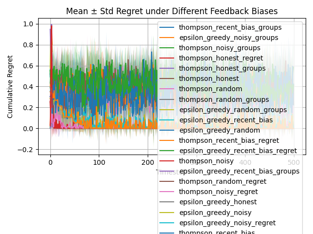
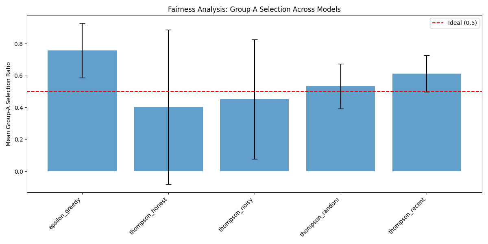

# Bandit Simulator with Biased Human Feedback

## Problem
Simulate how biased or noisy human feedback impacts the learning efficiency and fairness of online decision-making agents using bandit algorithms.

## Introduction
Online systems frequently learn from human preferences rather than explicit rewards. In real-world settings, human feedback is often noisy, delayed, or strategically biased (e.g., favoring recent or popular items). We build a Python simulator to quantify how these biases impact:  
- **Learning efficiency** (cumulative regret)  
- **Fairness** (selection disparity between two synthetic item groups)
  
## Setup
- 10 items with latent quality
- User models: honest, noisy, random, recency-biased
- Algorithms: Epsilon-Greedy, Thompson Sampling
- Evaluated on cumulative regret and fairness (group selection ratio)

## Simulator Design  
- **Items:** 10 synthetic items, each assigned a latent quality ∈ [0,1].  
- **Groups:** Each item is randomly labeled group A or B for fairness tracking.  

## User Models  
1. **Honest:** Always prefers the higher-quality item.  
2. **Noisy:** Chooses correctly with probability sigmoid(Δ/0.2).  
3. **Random:** 50/50 choice.  
4. **Recency-biased:** Always favors the most recently shown item.

## Algorithms  
- **ε-Greedy:** ε=0.1  
- **Thompson Sampling** (Beta(1,1) priors)  

## Experimental Protocol  
- **Seeds:** [0,1,2,3,4]  
- **Timesteps per run:** 500  
- **Runs:** 5 per (algorithm × user model)  
- **Data:**  
  - Regret time series saved in `results/{agent}_{bias}_regret.csv`  
  - Final group-A ratios in `results/{agent}_{bias}_groups.csv`

## Results
- Thompson Sampling consistently outperformed ε-Greedy under high noise.
- Recency-biased feedback led to over-selection of lower-quality items.
- Group A received ~70% of selections under random user model, indicating fairness issues.
 - Final Cumulative Regret

| Algorithm          | Bias         | Mean Regret | Std Dev Regret |
|--------------------|--------------|-------------|----------------|
| ε-Greedy           | honest       | 0.000000    | 0.000000       |
| ε-Greedy           | noisy        | 0.001387    | 0.001902       |
| ε-Greedy           | random       | 0.414210    | 0.072947       |
| ε-Greedy           | recent_bias  | 0.586225    | 0.211482       |
| Thompson Sampling  | honest       | 0.000000    | 0.000000       |
| Thompson Sampling  | noisy        | 0.014591    | 0.030790       |
| Thompson Sampling  | random       | 0.228210    | 0.239611       |
| Thompson Sampling  | recent_bias  | 0.366670    | 0.286378       |

  
  
*Figure 1. Mean ± standard deviation of cumulative regret over 500 timesteps.*  

## Fairness: Group-A Selection Ratio  
From each file `results/{agent}_{bias}_groups.csv`, we take the five final‐run ratios and compute mean ± std.  

| Algorithm          | Bias         | Mean Group-A Ratio | Std Dev Ratio |
|--------------------|--------------|---------------------|----------------|
| ε-Greedy           | honest       | 0.7564              | 0.190585       |
| ε-Greedy           | noisy        | 0.7212              | 0.217984       |
| ε-Greedy           | random       | 0.4668              | 0.456665       |
| ε-Greedy           | recent_bias  | 0.5456              | 0.394138       |
| Thompson Sampling  | honest       | 0.4024              | 0.540077       |
| Thompson Sampling  | noisy        | 0.4512              | 0.418601       |
| Thompson Sampling  | random       | 0.5328              | 0.156586       |
| Thompson Sampling  | recent_bias  | 0.6120              | 0.127851       |

## Average Regret & Fairness Disparity
| Algorithm          | Avg. Regret (All Biases) | Avg. Std Regret | Avg. Group-A Ratio | Avg. Disparity from 0.5 |
|--------------------|--------------------------|------------------|---------------------|--------------------------|
| ε-Greedy           | 0.250455                 | 0.071583         | 0.62255             | 0.12255                  |
| Thompson Sampling  | 0.152934                 | 0.139695         | 0.49960             | 0.00040                  |

  
  
*Figure 2. Mean group-A selection ratio across user models and algorithms.*  

## Interpretation
-Thompson Sampling has lower regret overall and is closer to fair selection (group parity).
-ε-Greedy learns slower and shows larger bias toward certain groups, especially under “honest” and “noisy” feedback.

